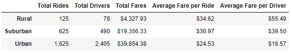
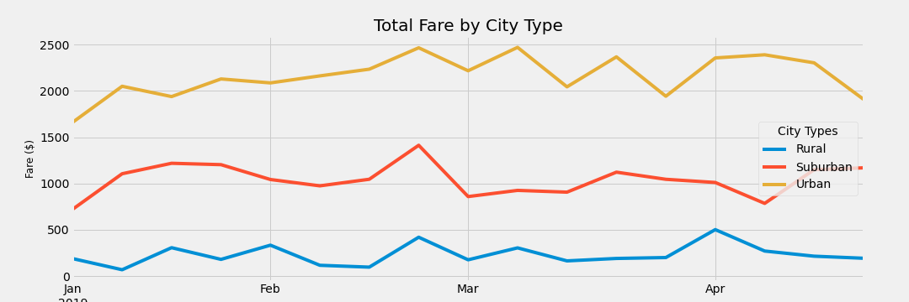

# PyBer_Analysis
### Ride-sharing analysis

## Project Overview 

### Purpose

The purpose of this study was to explore data obtained by PyBer, a ride-sharing company, to further look into the total weekly fares of different city types that PyBer services. The average fares were grouped into one of three city types: urban, suburban, and rural. The different city types were used to create data visualizations to better understand how PyBer should promote access to ride sharing, as well as understanding how affordable rides are based on the area's population and density of said population. 

## Analysis

### Summary Statistics of Ridesharing Data For Each City Type 
The following dataframe was created to compare how many rides, how many drivers, and the average rates charged for each type of city.

##### PyBer Summary for City Type

From this data set, it can be concluded that as the city type becomes more populated and dense, the amount of rides taken increases significantly, while the average rate per ride decreases. This looks to be due to the accessability in more urban spaces, and having a larger driver pool. Since the drivers have more competition for rides this brings the average fare per driver down. Adversely, in rural communities there are less drivers, which increases the average fare per driver well above the rates of urban communities. 

### Analysis of Total Fares for each City Type

The following line chart shows the total fare by city type for every week, from January 2019 to April 2019.

 Based on the above chart, the total fares of ride-share services is seemingly steady over time, regaurdless of the city type.  Urban communities are Pyber's biggest generator of ride-share revenue, followed by suburban, and then rural cities. 

## Summary 

Rural cities seem to be underserved. It is reccommended to further dive in an obtain more data to see if there is enough demand for ridesharing to justify hiring drivers, to lower costs for customers in rural cities. 
Furthermore, it would be a good idea to look into the distance traveled for these rides. This may give us an idea into wheather it is supply and demand that effects the average fares for each city, or if rural cities have to travel farther per ride than their urban city counterparts. Which could also drive up the cost for PyBer customers. 
